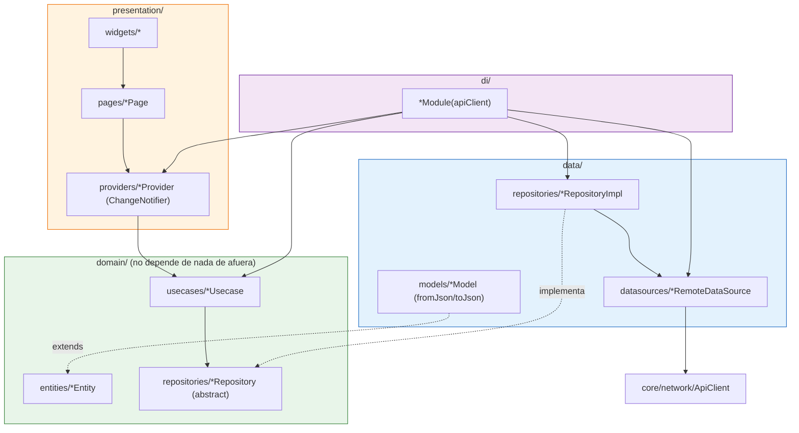
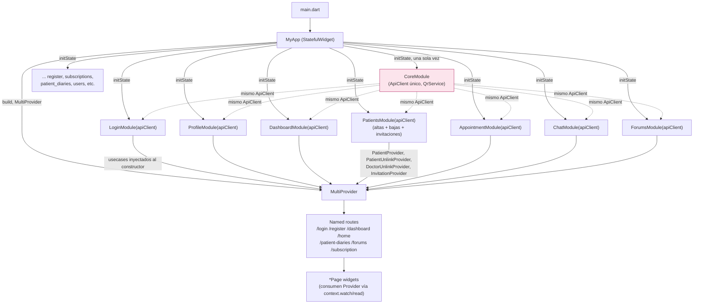
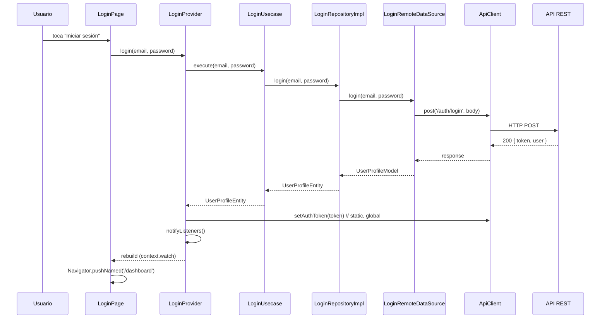
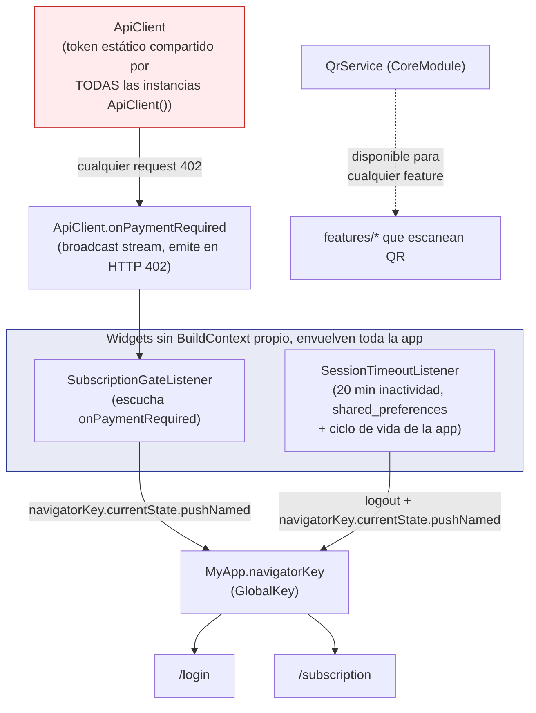
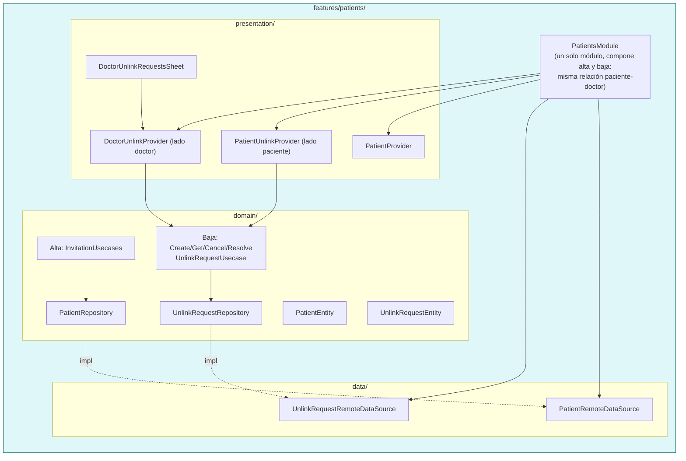

# Diagramas de arquitectura — Salud Prenatal

Cada bloque es un diagrama Mermaid independiente. Cópialos tal cual en cualquier
visor compatible (GitHub, Mermaid Live Editor, Obsidian, etc.).

## 1. Capas de una feature (Clean Architecture, feature-first)



## 2. Composition root (`app.dart`) — dónde se arma y dónde se inyecta



## 3. Cómo trabaja Provider (lectura y notificación)

```mermaid
flowchart LR
    subgraph Widget tree
        PageA["PatientsListPage"]
        PageB["PatientDetailSheet"]
    end

    PageA -->|context.watch| CN["ChangeNotifierProvider<PatientProvider>\n(vive arriba en el árbol, wireado en app.dart)"]
    PageB -->|context.watch| CN

    CN --> UC["Usecase.call(...)"]
    UC --> Repo["RepositoryImpl"]
    Repo --> DS["RemoteDataSource"]
    DS --> API["API REST"]

    API -.response.-> DS
    DS -.entity/model.-> Repo
    Repo -.entity.-> UC
    UC -.resultado.-> CN
    CN -->|notifyListeners()| PageA
    CN -->|notifyListeners()| PageB

    note1["Solo los widgets que hacen watch/context.select\nse reconstruyen; el resto del árbol no."]
    CN -.-> note1
```

## 4. Flujo de una petición completa (ejemplo: login)



## 5. Dependencias globales y listeners transversales



## 6. Vertical slice real: `patients` tras la fusión con `unlink_requests`


